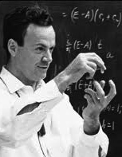
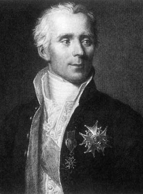

# Heroes #

[Edwin Thompson Jaynes][Jaynes]

[Ronald Coase][Coase]

[Fischer Black][Black]

[John Maynard Keynes][Keynes]

[John von Neumann][vonNeumann]

[Richard Feynman][Feynman]

[Pierre-Simon Laplace][Laplace]

[Cedric Villani][Villani] and [his heroes][heroes]

[heroes]: [http://cedricvillani.org/heroes/].
[Villani]: http://en.wikipedia.org/wiki/Cédric_Villani
[Jaynes]: http://en.wikipedia.org/wiki/Edwin_Thompson_Jaynes
[Coase]: http://en.wikipedia.org/wiki/Ronald_Coase
[Black]: http://en.wikipedia.org/wiki/Fischer_Black
[Keynes]: http://en.wikipedia.org/wiki/John_Maynard_Keynes
[vonNeumann]: http://en.wikipedia.org/wiki/Von_neumann
[Feynman]: http://en.wikipedia.org/wiki/Richard_Feynman
[Laplace]: http://en.wikipedia.org/wiki/Pierre-Simon_Laplace

